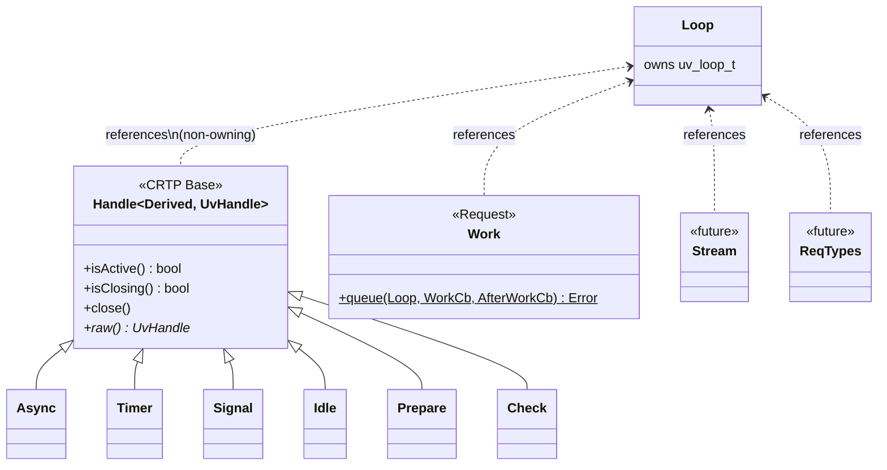
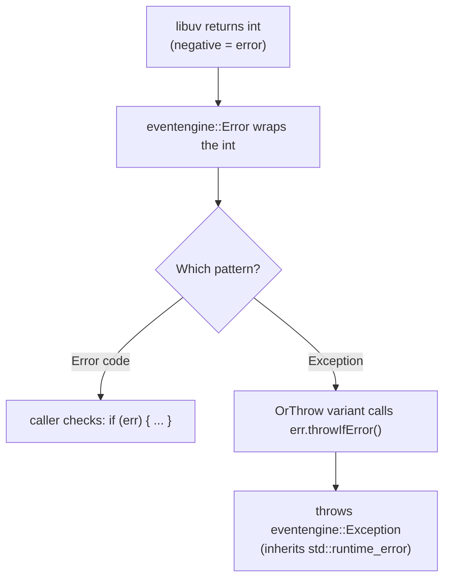
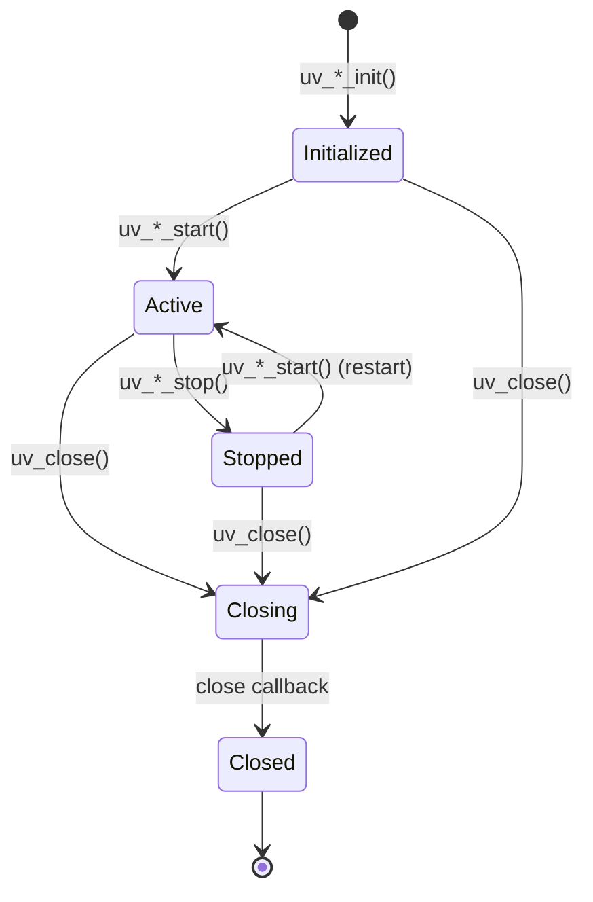
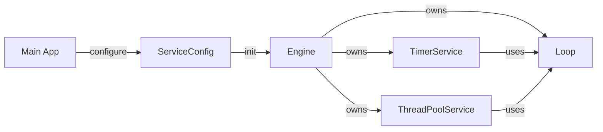

# EventEngine — Library Design Document

## 1. Class Hierarchy & Ownership Model



### Ownership Rules

- **Loop** owns the `uv_loop_t` (stack-allocated member). Destructor cleans up.
- **Handles** hold a non-owning reference (`Loop&`) to their parent loop. The user must ensure the Loop outlives all its handles.
- **Handle<D,U>** owns the `uv_*_t` handle (stack-allocated member). Destructor calls `uv_close()`.
- **Work** heap-allocates an internal `Context` struct containing `uv_work_t`. The context self-destructs in the `after_work` callback.

### Object Lifetime Contract

```mermaid
sequenceDiagram
    participant User
    participant Loop
    participant Handle
    participant libuv

    User->>Loop: create Loop()
    Loop->>libuv: uv_loop_init()

    User->>Handle: create Handle(loop)
    Handle->>libuv: uv_*_init()

    User->>Handle: start(callback, ...)
    Handle->>libuv: uv_*_start()

    User->>Loop: run()
    Loop->>libuv: uv_run()
    libuv-->>Handle: invoke callback

    User->>Handle: stop() [optional]
    Handle->>libuv: uv_*_stop()

    Note over Handle: destructor
    Handle->>libuv: uv_close() if still active

    Note over Loop: destructor
    Loop->>libuv: force-close remaining handles
    Loop->>libuv: uv_run() drain
    Loop->>libuv: uv_loop_close()
```

**Critical invariant**: Loop must outlive all handles attached to it.

---

## 2. Error Handling Design

### Dual Error Model

Every fallible operation provides two variants:

| Pattern | Method | Behavior on failure |
|---------|--------|-------------------|
| Error code | `start(...)` | Returns `eventengine::Error` (caller checks) |
| Exception | `startOrThrow(...)` | Throws `eventengine::Exception` |

### Error Propagation



### Error in Callbacks

Callbacks do **not** propagate exceptions back into libuv. If a user callback throws, it is undefined behavior (libuv is C code and cannot handle C++ exceptions unwinding through it).

**Convention**: Users must catch exceptions inside their callbacks, or use error codes within callbacks.

### Constructor Errors

Handle constructors call `uv_*_init()`. If init fails, the constructor **throws** `eventengine::Exception` — there is no valid half-initialized state.

---

## 3. Handle Lifecycle — State Machine



### RAII Guarantees

- Constructor = Init (always). Failure throws.
- Destructor = Close (if not already closed/closing).
- `close()` is idempotent — safe to call multiple times.
- After `close()`, calling `start()` returns an error (does not crash).

### Move Semantics

- Move transfers ownership of the underlying `uv_*_t` handle.
- Source handle is left in a "moved-from" state (`closed_ = true`).
- `handle_.data` pointer is updated to point to the new owner.

---

## 4. Thread Safety Design

### Thread Safety Guarantees

| Class | Thread-safe? | Notes |
|-------|-------------|-------|
| `Error` | Yes | Immutable after construction |
| `Exception` | Yes | Immutable after construction |
| `Loop` | No | Must be used from one thread (the "loop thread") |
| `Handle<D,U>` | No | Must be used from the loop thread |
| `Async` | **send() only** | `send()` is the only thread-safe libuv call. All other methods must be called from the loop thread |
| `Work` | **queue() only** | `queue()` can be called from any thread. The work callback runs on a thread pool thread. The after_work callback runs on the loop thread |

### Callback Thread Guarantees

| Callback | Runs on |
|----------|---------|
| Timer callback | Loop thread |
| Signal callback | Loop thread |
| Idle/Prepare/Check callback | Loop thread |
| Async callback | Loop thread |
| Work::work_cb | Thread pool thread |
| Work::after_work_cb | Loop thread |

---

## 5. API Conventions

### Naming

- **Namespace**: `eventengine` (core), `eventengine::timer`, `eventengine::threadpool`
- **Classes**: PascalCase — `Timer`, `Loop`, `Error`
- **Methods**: camelCase — `start()`, `startOrThrow()`, `isActive()`
- **Callbacks**: `using Callback = std::function<void(...)>;` defined per class
- **Constants/Enums**: PascalCase — `RunMode::Default`

### Method Patterns

Every handle follows this consistent API surface:

```cpp
class SomeHandle : public Handle<SomeHandle, uv_some_t> {
public:
    using Callback = std::function<void(/* args */)>;

    explicit SomeHandle(Loop& loop);        // init — throws on failure

    Error start(Callback cb, /* params */); // start with error code return
    void startOrThrow(Callback cb, ...);    // start with exception on failure

    Error stop();                           // stop with error code return
    void stopOrThrow();                     // stop with exception on failure

    // Handle base provides:
    bool isActive() const;
    bool isClosing() const;
    void close();
    uv_some_t* raw() noexcept;
};
```

### raw() Escape Hatch

Every wrapper exposes `raw()` returning a pointer to the underlying libuv type. This allows:
- Interop with raw libuv APIs not yet wrapped
- Advanced usage without forking the library
- Zero-cost when not used

### Callback Storage

- Each handle stores its callback as a `std::function` member.
- The callback is set/replaced on `start()`.
- A static C function (e.g., `onTimer`) is registered with libuv. It recovers `this` via `handle->data` and invokes the stored `std::function`.

```cpp
// Internal pattern (Timer example)
static void onTimer(uv_timer_t* handle) {
    auto* self = static_cast<Timer*>(handle->data);
    if (self->callback_) self->callback_();
}
```

---

## 6. Configuration Headers

### `include/eventengine/export.hpp` — Symbol Export Macros

```cpp
// Handles dllexport/dllimport on Windows, visibility on Unix
#if defined(_WIN32)
  #if defined(EVENTENGINE_BUILDING_SHARED)
    #define EVENTENGINE_API __declspec(dllexport)
  #elif defined(EVENTENGINE_USING_SHARED)
    #define EVENTENGINE_API __declspec(dllimport)
  #else
    #define EVENTENGINE_API
  #endif
#else
  #if defined(EVENTENGINE_BUILDING_SHARED)
    #define EVENTENGINE_API __attribute__((visibility("default")))
  #else
    #define EVENTENGINE_API
  #endif
#endif
```

- `EVENTENGINE_BUILDING_SHARED` is defined by CMake when building the shared library target.
- `EVENTENGINE_USING_SHARED` is defined by consumers linking against the shared library.
- Static library builds define neither — `EVENTENGINE_API` expands to nothing.

### `include/eventengine/version.hpp` — Version Information

```cpp
#define EVENTENGINE_VERSION_MAJOR 0
#define EVENTENGINE_VERSION_MINOR 1
#define EVENTENGINE_VERSION_PATCH 0
#define EVENTENGINE_VERSION_STRING "0.1.0"
```

Generated from CMake project version via `configure_file`.

### `include/eventengine/fwd.hpp` — Forward Declarations

```cpp
namespace eventengine {
    class Error;
    class Exception;
    class Loop;
    template <typename Derived, typename UvHandle> class Handle;
    enum class Service;
    class ServiceConfig;

    namespace timer {
        class Duration;
        class RepeatPolicy;
        class Timer;
        class TimerService;
        enum class TimerStatus;
        enum class TimerEvent;
        struct TimerInfo;
    }

    namespace threadpool {
        class Work;
        class ThreadPoolService;
        enum class TaskStatus;
        struct TaskInfo;
    }
}
```

Allows headers to reference other EventEngine types without pulling in full definitions.

---

## 7. Service Layer

Each service is documented in its own spec under `docs/services/`:

- [TIMER_SERVICE.md](services/TIMER_SERVICE.md) — TimerService feature spec
- [THREAD_POOL_SERVICE.md](services/THREAD_POOL_SERVICE.md) — ThreadPoolService feature spec


