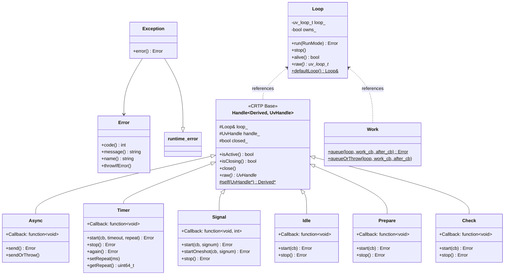
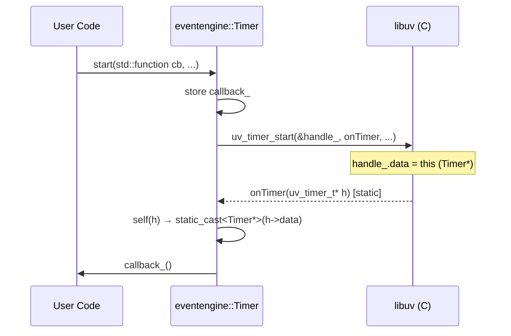
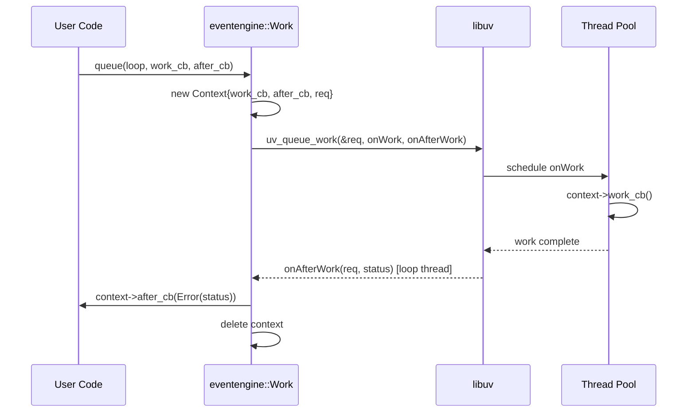

# EventEngine — Phase 1 Implementation Document

## Table of Contents

1. [Architecture Overview](#1-architecture-overview)
2. [Namespace & Conventions](#2-namespace--conventions)
3. [Error Handling](#3-error-handling---eventengineerror--eventengineexception)
4. [Loop](#4-loop---eventengineloop)
5. [Handle Base](#5-handle-base---eventenginehandle)
6. [Async](#6-async---eventengineasync)
7. [Timer](#7-timer---eventenginetimer)
8. [Signal](#8-signal---eventenginesignal)
9. [Idle](#9-idle---eventengineidle)
10. [Prepare](#10-prepare---eventengineprepare)
11. [Check](#11-check---eventenginecheck)
12. [Work (Thread Pool)](#12-work-thread-pool---eventenginework)
13. [Build System](#13-build-system)
14. [Unit Tests](#14-unit-tests)
15. [Future Phases](#15-future-phases)

---

## 1. Architecture Overview

### Project Structure

```
eventengine/
├── CMakeLists.txt
├── cmake/
│   └── eventengineConfig.cmake.in
├── include/
│   └── eventengine/
│       ├── error.hpp
│       ├── loop.hpp
│       ├── handle.hpp
│       ├── async.hpp
│       ├── timer.hpp
│       ├── signal.hpp
│       ├── idle.hpp
│       ├── prepare.hpp
│       ├── check.hpp
│       ├── work.hpp
│       └── eventengine.hpp
├── src/
│   ├── CMakeLists.txt
│   ├── core/
│   │   ├── error.cpp
│   │   └── loop.cpp
│   └── timer/
│       ├── core/timer.cpp
│       └── service/
│           ├── duration.cpp
│           ├── repeat_policy.cpp
│           └── timer_service.cpp
├── tests/
│   ├── CMakeLists.txt
│   └── test_timer_service.cpp
├── third_party/
│   └── libuv/              ← git submodule
└── docs/
    ├── README.md
    └── IMPLEMENTATION.md
```

### Class Hierarchy



### Design Principles

- **RAII**: All libuv resources are acquired in constructors and released in destructors.
- **Non-copyable, movable**: Handles cannot be copied. Move transfers ownership.
- **CRTP for Handle base**: Zero-overhead static polymorphism. Each derived handle passes itself as template argument to `Handle<Derived>`.
- **`handle->data` pointer**: Set to `this` (the C++ wrapper), used in static C callbacks to dispatch to `std::function` members.
- **Dual error handling**: Every operation returns `eventengine::Error`. A companion `*OrThrow` method throws `eventengine::Exception` on failure.
- **Bundled libuv**: libuv is included as a git submodule under `third_party/libuv` — no external dependency.

### Callback Dispatch Flow



### Thread Pool Work Flow



---

## 2. Namespace & Conventions

- **Namespace**: `eventengine`
- **Header guard**: `EVENTENGINE_<MODULE>_HPP`
- **File naming**: lowercase, underscore-free (e.g., `timer.hpp`, `timer.cpp`)
- **Method naming**: camelCase (e.g., `start()`, `startOrThrow()`)
- **Callback type alias**: `using Callback = std::function<void()>;` (per handle, may vary)

---

## 3. Error Handling — `eventengine::Error` & `eventengine::Exception`

### Header: `include/eventengine/error.hpp`

```cpp
namespace eventengine {

class Error {
public:
    Error() noexcept;                   // no error (code = 0)
    explicit Error(int uv_errno) noexcept;

    explicit operator bool() const noexcept;  // true if error
    int code() const noexcept;
    std::string message() const;        // wraps uv_strerror()
    std::string name() const;           // wraps uv_err_name()

    void throwIfError() const;          // throws Exception if code != 0

private:
    int code_;
};

class Exception : public std::runtime_error {
public:
    explicit Exception(Error err);

    const Error& error() const noexcept;

private:
    Error error_;
};

} // namespace eventengine
```

### Source: `src/error.cpp`

- `Error()` sets `code_ = 0`.
- `Error(int)` stores the raw libuv error code.
- `operator bool()` returns `code_ < 0` (libuv convention: negative = error).
- `message()` calls `uv_strerror(code_)`.
- `name()` calls `uv_err_name(code_)`.
- `throwIfError()` throws `Exception(*this)` if `code_ < 0`.
- `Exception` stores the `Error` and passes `error.message()` to `std::runtime_error`.

### Usage Pattern

```cpp
// Error code style
eventengine::Error err = timer.start(cb, 1000, 0);
if (err) {
    std::cerr << err.message() << "\n";
}

// Exception style
timer.startOrThrow(cb, 1000, 0);  // throws eventengine::Exception on failure
```

---

## 4. Loop — `eventengine::Loop`

### Header: `include/eventengine/loop.hpp`

```cpp
namespace eventengine {

class Loop {
public:
    enum class RunMode {
        Default = UV_RUN_DEFAULT,
        Once    = UV_RUN_ONCE,
        NoWait  = UV_RUN_NOWAIT
    };

    Loop();                             // creates a new loop via uv_loop_init
    ~Loop();                            // closes via uv_loop_close

    Loop(const Loop&) = delete;
    Loop& operator=(const Loop&) = delete;
    Loop(Loop&& other) noexcept;
    Loop& operator=(Loop&& other) noexcept;

    Error run(RunMode mode = RunMode::Default);
    void stop();
    bool alive() const;

    uv_loop_t* raw() noexcept;
    const uv_loop_t* raw() const noexcept;

    static Loop& defaultLoop();         // wraps uv_default_loop()

private:
    uv_loop_t loop_;
    bool owns_;                         // false for default loop
};

} // namespace eventengine
```

### Source: `src/loop.cpp`

- Constructor calls `uv_loop_init(&loop_)`, sets `owns_ = true`. Throws on failure.
- Destructor: if `owns_`, walks all handles to close them, runs the loop to drain, then calls `uv_loop_close(&loop_)`.
- `run()` calls `uv_run(&loop_, static_cast<uv_run_mode>(mode))`, returns `Error`.
- `stop()` calls `uv_stop(&loop_)`.
- `alive()` returns `uv_loop_alive(&loop_) != 0`.
- `defaultLoop()` returns a static `Loop` wrapping `uv_default_loop()` with `owns_ = false`.
- Move constructor/assignment transfers `loop_` state and sets source `owns_ = false`.

### Key Behavior

- Destructor ensures no handle leaks — it force-closes any remaining handles before closing the loop.
- `raw()` provides escape hatch for advanced usage or interop with raw libuv APIs.

---

## 5. Handle Base — `eventengine::Handle<Derived>`

### Header: `include/eventengine/handle.hpp`

```cpp
namespace eventengine {

template <typename Derived, typename UvHandle>
class Handle {
public:
    Handle(const Handle&) = delete;
    Handle& operator=(const Handle&) = delete;

    bool isActive() const;
    bool isClosing() const;
    void close();

    UvHandle* raw() noexcept;
    const UvHandle* raw() const noexcept;

protected:
    explicit Handle(Loop& loop);
    ~Handle();

    Handle(Handle&& other) noexcept;
    Handle& operator=(Handle&& other) noexcept;

    Loop& loop_;
    UvHandle handle_;
    bool closed_;

    // Recover the C++ wrapper from a libuv handle pointer
    static Derived* self(UvHandle* h) {
        return static_cast<Derived*>(h->data);
    }
};

} // namespace eventengine
```

### Source: `src/handle.cpp` (template — implemented in header)

- Constructor sets `handle_.data = static_cast<Derived*>(this)` and `closed_ = false`.
- `isActive()` calls `uv_is_active(reinterpret_cast<uv_handle_t*>(&handle_))`.
- `isClosing()` calls `uv_is_closing(...)`.
- `close()`: if not closing and not closed, calls `uv_close(...)` with a callback that sets `closed_ = true`.
- Destructor calls `close()` if handle is still active.
- `self()` is the CRTP dispatch helper — casts `handle->data` back to `Derived*`.

### CRTP Pattern

Each derived class inherits as:
```cpp
class Timer : public Handle<Timer, uv_timer_t> { ... };
```

The static callback in each derived class uses `self(handle)` to recover the C++ object and invoke its `std::function` callback.

---

## 6. Async — `eventengine::Async`

### Header: `include/eventengine/async.hpp`

```cpp
namespace eventengine {

class Async : public Handle<Async, uv_async_t> {
public:
    using Callback = std::function<void()>;

    Async(Loop& loop, Callback cb);

    Error send();
    void sendOrThrow();

private:
    Callback callback_;
    static void onAsync(uv_async_t* handle);
};

} // namespace eventengine
```

### Source: `src/async.cpp`

- Constructor calls `uv_async_init(loop.raw(), &handle_, onAsync)`. Stores callback.
- `send()` calls `uv_async_send(&handle_)`, returns `Error`.
- `onAsync()` is the static C callback: calls `self(handle)->callback_()`.

### Usage

```cpp
eventengine::Loop loop;
eventengine::Async async(loop, []() {
    std::cout << "Signaled from another thread!\n";
});

// From another thread:
async.send();
```

---

## 7. Timer — `eventengine::Timer`

### Header: `include/eventengine/timer.hpp`

```cpp
namespace eventengine {

class Timer : public Handle<Timer, uv_timer_t> {
public:
    using Callback = std::function<void()>;

    explicit Timer(Loop& loop);

    Error start(Callback cb, uint64_t timeout_ms, uint64_t repeat_ms = 0);
    void startOrThrow(Callback cb, uint64_t timeout_ms, uint64_t repeat_ms = 0);

    Error stop();
    void stopOrThrow();

    Error again();
    void setRepeat(uint64_t repeat_ms);
    uint64_t getRepeat() const;
    uint64_t getDueIn() const;

private:
    Callback callback_;
    static void onTimer(uv_timer_t* handle);
};

} // namespace eventengine
```

### Source: `src/timer.cpp`

- Constructor calls `uv_timer_init(loop.raw(), &handle_)`.
- `start()` stores callback, calls `uv_timer_start(&handle_, onTimer, timeout, repeat)`.
- `stop()` calls `uv_timer_stop(&handle_)`.
- `again()` calls `uv_timer_again(&handle_)`.
- `setRepeat()` / `getRepeat()` / `getDueIn()` wrap the corresponding libuv functions.
- `onTimer()` calls `self(handle)->callback_()`.

### Usage

```cpp
eventengine::Loop loop;
eventengine::Timer timer(loop);

// One-shot timer (1 second)
timer.start([]() { std::cout << "Fired!\n"; }, 1000);

// Repeating timer (every 500ms)
timer.start([]() { std::cout << "Tick\n"; }, 0, 500);

loop.run();
```

---

## 8. Signal — `eventengine::Signal`

### Header: `include/eventengine/signal.hpp`

```cpp
namespace eventengine {

class Signal : public Handle<Signal, uv_signal_t> {
public:
    using Callback = std::function<void(int signum)>;

    explicit Signal(Loop& loop);

    Error start(Callback cb, int signum);
    void startOrThrow(Callback cb, int signum);

    Error startOneshot(Callback cb, int signum);
    void startOneshotOrThrow(Callback cb, int signum);

    Error stop();
    void stopOrThrow();

private:
    Callback callback_;
    static void onSignal(uv_signal_t* handle, int signum);
};

} // namespace eventengine
```

### Source: `src/signal.cpp`

- Constructor calls `uv_signal_init(loop.raw(), &handle_)`.
- `start()` stores callback, calls `uv_signal_start(&handle_, onSignal, signum)`.
- `startOneshot()` calls `uv_signal_start_oneshot(...)`.
- `stop()` calls `uv_signal_stop(&handle_)`.
- `onSignal()` calls `self(handle)->callback_(signum)`.

### Usage

```cpp
eventengine::Loop loop;
eventengine::Signal sig(loop);

sig.start([](int signum) {
    std::cout << "Caught signal: " << signum << "\n";
}, SIGINT);

loop.run();
```

---

## 9. Idle — `eventengine::Idle`

### Header: `include/eventengine/idle.hpp`

```cpp
namespace eventengine {

class Idle : public Handle<Idle, uv_idle_t> {
public:
    using Callback = std::function<void()>;

    explicit Idle(Loop& loop);

    Error start(Callback cb);
    void startOrThrow(Callback cb);

    Error stop();
    void stopOrThrow();

private:
    Callback callback_;
    static void onIdle(uv_idle_t* handle);
};

} // namespace eventengine
```

### Source: `src/idle.cpp`

- Constructor calls `uv_idle_init(loop.raw(), &handle_)`.
- `start()` stores callback, calls `uv_idle_start(&handle_, onIdle)`.
- `stop()` calls `uv_idle_stop(&handle_)`.
- `onIdle()` calls `self(handle)->callback_()`.

---

## 10. Prepare — `eventengine::Prepare`

### Header: `include/eventengine/prepare.hpp`

```cpp
namespace eventengine {

class Prepare : public Handle<Prepare, uv_prepare_t> {
public:
    using Callback = std::function<void()>;

    explicit Prepare(Loop& loop);

    Error start(Callback cb);
    void startOrThrow(Callback cb);

    Error stop();
    void stopOrThrow();

private:
    Callback callback_;
    static void onPrepare(uv_prepare_t* handle);
};

} // namespace eventengine
```

### Source: `src/prepare.cpp`

- Identical pattern to Idle. Constructor calls `uv_prepare_init(...)`.
- `start()` calls `uv_prepare_start(...)`.
- `stop()` calls `uv_prepare_stop(...)`.

---

## 11. Check — `eventengine::Check`

### Header: `include/eventengine/check.hpp`

```cpp
namespace eventengine {

class Check : public Handle<Check, uv_check_t> {
public:
    using Callback = std::function<void()>;

    explicit Check(Loop& loop);

    Error start(Callback cb);
    void startOrThrow(Callback cb);

    Error stop();
    void stopOrThrow();

private:
    Callback callback_;
    static void onCheck(uv_check_t* handle);
};

} // namespace eventengine
```

### Source: `src/check.cpp`

- Identical pattern to Idle/Prepare. Constructor calls `uv_check_init(...)`.

---

## 12. Work (Thread Pool) — `eventengine::Work`

### Header: `include/eventengine/work.hpp`

`Work` is **not** a handle — it wraps `uv_work_t` which is a request type.

```cpp
namespace eventengine {

class Work {
public:
    using WorkCallback = std::function<void()>;
    using AfterWorkCallback = std::function<void(Error)>;

    Work(const Work&) = delete;
    Work& operator=(const Work&) = delete;

    static Error queue(Loop& loop,
                       WorkCallback work_cb,
                       AfterWorkCallback after_cb);

    static void queueOrThrow(Loop& loop,
                              WorkCallback work_cb,
                              AfterWorkCallback after_cb);

private:
    struct Context {
        WorkCallback work_cb;
        AfterWorkCallback after_cb;
        uv_work_t req;
    };

    static void onWork(uv_work_t* req);
    static void onAfterWork(uv_work_t* req, int status);
};

} // namespace eventengine
```

### Source: `src/work.cpp`

- `queue()` allocates a `Context` on the heap, stores both callbacks, sets `req.data = context`.
- Calls `uv_queue_work(loop.raw(), &context->req, onWork, onAfterWork)`.
- `onWork()` runs on the thread pool: calls `context->work_cb()`.
- `onAfterWork()` runs on the loop thread: calls `context->after_cb(Error(status))`, then `delete context`.
- The `Context` is self-cleaning — freed in `onAfterWork`.

### Usage

```cpp
eventengine::Loop loop;

eventengine::Work::queue(loop,
    []() {
        // Runs on thread pool
        heavy_computation();
    },
    [](eventengine::Error err) {
        // Runs on loop thread after work completes
        if (err) std::cerr << err.message() << "\n";
        else std::cout << "Work done!\n";
    }
);

loop.run();
```

---

## 13. Build System

### Root `CMakeLists.txt`

```cmake
cmake_minimum_required(VERSION 3.16)
project(eventengine VERSION 0.1.0 LANGUAGES C CXX)

set(CMAKE_CXX_STANDARD 17)
set(CMAKE_CXX_STANDARD_REQUIRED ON)

option(EVENTENGINE_BUILD_SHARED  "Build shared library" ON)
option(EVENTENGINE_BUILD_STATIC  "Build static library" ON)
option(EVENTENGINE_BUILD_TESTS   "Build unit tests"     ON)
option(EVENTENGINE_BUILD_EXAMPLES "Build examples"      ON)

# libuv (bundled as submodule)
set(LIBUV_BUILD_SHARED OFF CACHE BOOL "" FORCE)
set(BUILD_TESTING OFF CACHE BOOL "" FORCE)
add_subdirectory(third_party/libuv)

add_subdirectory(src)

if(EVENTENGINE_BUILD_TESTS)
    enable_testing()
    add_subdirectory(tests)
endif()

if(EVENTENGINE_BUILD_EXAMPLES)
    add_subdirectory(examples)
endif()
```

### `src/CMakeLists.txt`

- Collects all `.cpp` files into a source list.
- If `EVENTENGINE_BUILD_STATIC`: creates `eventengine_static` target (`add_library(... STATIC ...)`).
- If `EVENTENGINE_BUILD_SHARED`: creates `eventengine_shared` target (`add_library(... SHARED ...)`).
- Both targets link against `uv_a` (bundled libuv static) and set `include/` as public include directory.
- Sets `EVENTENGINE_BUILDING_SHARED` compile definition for the shared target.

### `tests/CMakeLists.txt`

- Fetches GoogleTest via FetchContent.
- Creates one test executable per test file, linked against `eventengine_static` and `GTest::gtest_main`.
- Registers each with `gtest_discover_tests()`.

### Cross-Platform Compilation

```bash
# Linux / macOS (GCC or Clang)
cmake -B build
cmake --build build

# Windows (MSVC)
cmake -B build -G "Visual Studio 17 2022"
cmake --build build --config Release

# Windows (MinGW)
cmake -B build -G "MinGW Makefiles"
cmake --build build
```

---

## 14. Unit Tests

All tests use GoogleTest. Each test file covers one module.

### Test Strategy

| Test File | Key Test Cases |
|-----------|---------------|
| `test_error.cpp` | Default error is no-error; error from UV code; message/name strings; throwIfError |
| `test_loop.cpp` | Create/destroy; run empty loop returns immediately; alive() is false when empty; stop() |
| `test_timer.cpp` | One-shot fires once; repeat fires multiple times; stop prevents firing; getDueIn/getRepeat |
| `test_async.cpp` | Send from same thread triggers callback; send from another thread triggers callback |
| `test_signal.cpp` | Start/stop without crash; callback receives correct signum (using SIGUSR1 on Unix) |
| `test_idle.cpp` | Callback fires; stop prevents further callbacks |
| `test_prepare.cpp` | Callback fires before I/O polling |
| `test_check.cpp` | Callback fires after I/O polling |
| `test_work.cpp` | Work callback runs on different thread; after_work runs on loop thread; error propagation |

### Example Test

```cpp
// test_timer.cpp
#include <gtest/gtest.h>
#include <eventengine/eventengine.hpp>

TEST(TimerTest, OneShotFires) {
    eventengine::Loop loop;
    eventengine::Timer timer(loop);
    int count = 0;

    timer.start([&]() {
        count++;
        timer.stop();
    }, 10);

    loop.run();
    EXPECT_EQ(count, 1);
}

TEST(TimerTest, RepeatFires) {
    eventengine::Loop loop;
    eventengine::Timer timer(loop);
    int count = 0;

    timer.start([&]() {
        count++;
        if (count >= 3) timer.stop();
    }, 10, 10);

    loop.run();
    EXPECT_EQ(count, 3);
}
```

---

## 15. Future Phases

| Phase | Modules |
|-------|---------|
| Phase 2 | TCP (client/server), UDP |
| Phase 3 | Pipes, TTY, Process spawning |
| Phase 4 | Filesystem operations |
| Phase 5 | DNS resolution, Network interfaces |
| Phase 6 | Shared memory, Semaphores, Mutexes (threading primitives) |

---

## Appendix: libuv Handle ↔ EventEngine Class Mapping

| libuv Type | EventEngine Class | Category |
|------------|---------------|----------|
| `uv_loop_t` | `eventengine::Loop` | Core |
| `uv_async_t` | `eventengine::Async` | Handle |
| `uv_timer_t` | `eventengine::Timer` | Handle |
| `uv_signal_t` | `eventengine::Signal` | Handle |
| `uv_idle_t` | `eventengine::Idle` | Handle |
| `uv_prepare_t` | `eventengine::Prepare` | Handle |
| `uv_check_t` | `eventengine::Check` | Handle |
| `uv_work_t` | `eventengine::Work` | Request |
