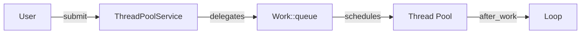
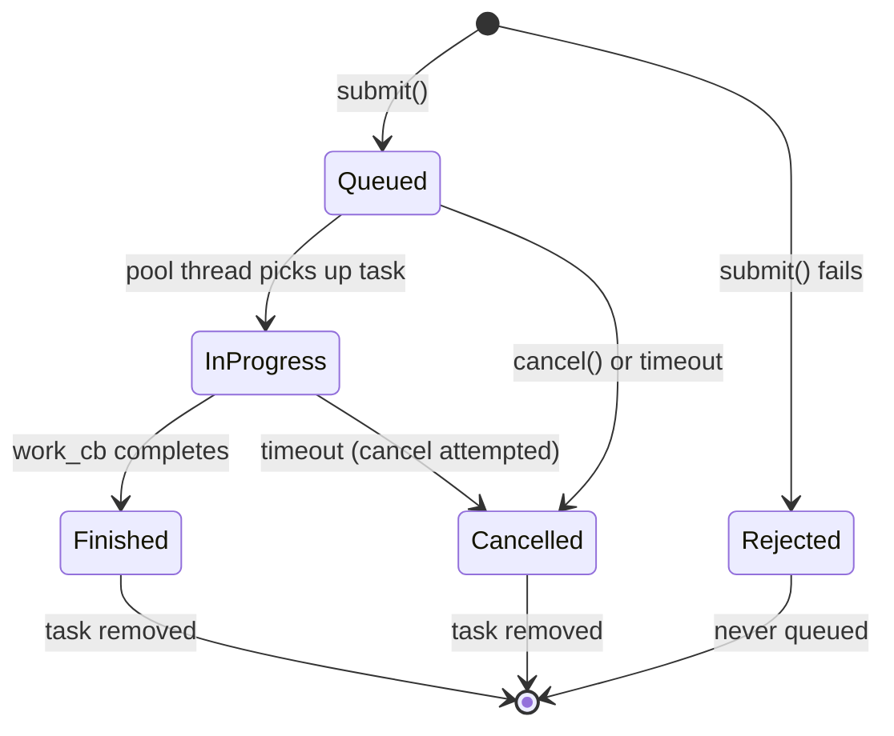
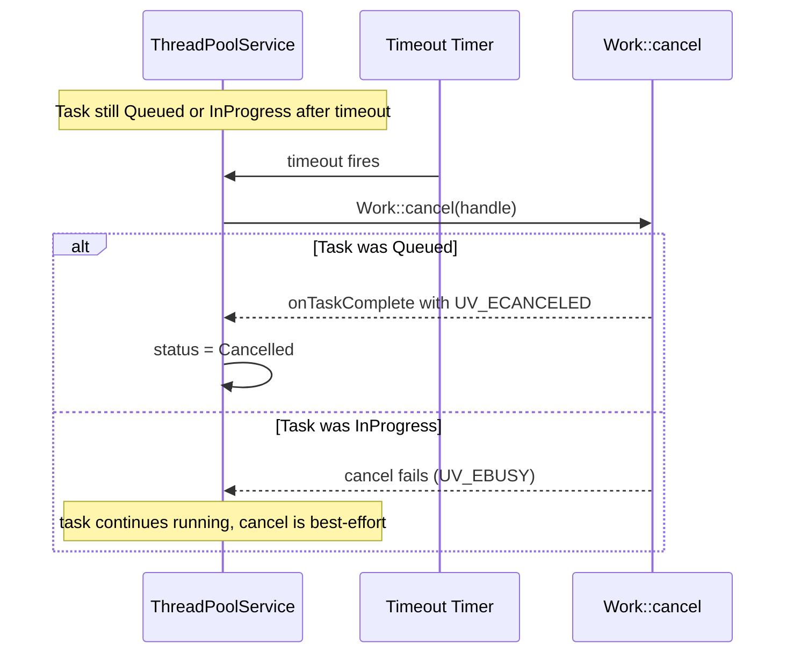

# ThreadPoolService — Design Document

## 1. Overview

ThreadPoolService is a high-level managed API built on top of the low-level `eventengine::Work` request wrapper. It provides named task submission, cancellation, timeout, status querying, and automatic tracking of active and completed task counts.



---

## 2. Feature List

| # | Feature | Status | Description |
|---|---------|--------|-------------|
| F01 | Named task submission | ✅ Implemented | Each task identified by a unique string name |
| F02 | After-work callback | ✅ Implemented | Callback on loop thread receives task name and Error |
| F03 | Task cancellation | ✅ Implemented | Cancel queued tasks by name via `uv_cancel` |
| F04 | Task timeout | ✅ Implemented | Auto-cancel tasks exceeding a Duration via internal Timer |
| F05 | Task status query | ✅ Implemented | Query lifecycle state by name |
| F06 | Task info query | ✅ Implemented | Get name, status, and timeout snapshot |
| F07 | List all tasks | ✅ Implemented | Get names of all tracked tasks |
| F08 | Active count | ✅ Implemented | Atomic counter of in-flight tasks |
| F09 | Completed count | ✅ Implemented | Atomic cumulative counter of finished tasks |
| F10 | Dual error model | ✅ Implemented | submit/cancel return Error, OrThrow variants throw |
| F11 | Failure rollback | ✅ Implemented | activeCount rolled back if Work::queue fails |
| F12 | Duplicate name rejection | ✅ Implemented | submit returns `UV_EEXIST` for duplicate names |
| F13 | Empty name rejection | ✅ Implemented | submit returns `UV_EINVAL` for empty names |
| F14 | Configurable pool size | 🔲 Future | Set `UV_THREADPOOL_SIZE` via ServiceConfig (requires Engine) |
| F15 | Priority queues | 🔲 Future | High/low priority submission ordering (requires custom scheduler) |
| F16 | Dynamic pool resize | 🔲 Future | Add workers at runtime (requires custom thread management) |

---

## 3. Task Lifecycle — `eventengine::TaskStatus`

### State Machine



### `eventengine::TaskStatus` (enum class)

```cpp
namespace eventengine {

enum class TaskStatus {
    Queued,     // waiting in queue, not yet picked up by a pool thread
    InProgress, // executing on a pool thread
    Finished,   // completed successfully
    Cancelled,  // cancelled by user or timeout
    Rejected    // never queued (duplicate name, empty name, or queue failure)
};

} // namespace eventengine
```

| Status | Meaning | Transition from |
|--------|---------|-----------------|
| `Queued` | Task is in libuv's work queue, waiting for a free thread | Initial state after successful submit |
| `InProgress` | A pool thread is executing the work callback | `Queued` → pool thread picks it up |
| `Finished` | Work callback completed, after-work callback invoked | `InProgress` → work_cb returns |
| `Cancelled` | Task was cancelled before completion | `Queued` → cancel() or timeout; `InProgress` → timeout |
| `Rejected` | Task was never accepted into the queue | submit() with duplicate name, empty name, or queue failure |

---

## 4. Task Info — `eventengine::TaskInfo`

```cpp
namespace eventengine {

struct TaskInfo {
    std::string name;       // user-provided task name
    TaskStatus status;      // current lifecycle status
    Duration timeout;       // configured timeout (zero = no timeout)
};

} // namespace eventengine
```

---

## 5. Low-Level Primitive — Work

### `eventengine::Work`

A fire-and-forget request type wrapping `uv_queue_work` and `uv_cancel`. The internal Context is heap-allocated and self-destructs in the after-work callback.

```cpp
namespace eventengine {

class Work {
public:
    using WorkCb = std::function<void()>;
    using AfterWorkCb = std::function<void(Error)>;
    using Handle = uv_work_t*;

    Work() = delete;

    static Error queue(Loop& loop, WorkCb work_cb, AfterWorkCb after_cb,
                       Handle* handle = nullptr);
    static void queueOrThrow(Loop& loop, WorkCb work_cb, AfterWorkCb after_cb,
                              Handle* handle = nullptr);

    static Error cancel(Handle handle);
    static void cancelOrThrow(Handle handle);

private:
    struct Context {
        uv_work_t req{};
        WorkCb workCb;
        AfterWorkCb afterCb;
    };

    static void onWork(uv_work_t* req);
    static void onAfterWork(uv_work_t* req, int status);
};

} // namespace eventengine
```

### Context Lifecycle

```mermaid
sequenceDiagram
    participant User
    participant Work
    participant Pool as Thread Pool
    participant Loop as Loop Thread

    User->>Work: queue(loop, work_cb, after_cb, &handle)
    Work->>Work: new Context{req, work_cb, after_cb}
    Work->>Pool: uv_queue_work()

    Pool->>Pool: context->workCb()
    Pool-->>Loop: work complete

    Loop->>Work: onAfterWork(req, status)
    Work->>User: context->afterCb(Error(status))
    Work->>Work: delete context
```

### Cancel Behavior

`uv_cancel` only succeeds on tasks that are **queued but not yet started**. If the task is already running on a pool thread, cancel returns an error. On successful cancel, the after-work callback is invoked with `UV_ECANCELED`.

---

## 6. ThreadPoolService API

### `eventengine::ThreadPoolService`

```cpp
namespace eventengine {

class ThreadPoolService {
public:
    using WorkCallback = std::function<void()>;
    using AfterWorkCallback = std::function<void(const std::string& name, Error)>;

    explicit ThreadPoolService(Loop& loop);
    ~ThreadPoolService();

    // --- Submit ---
    Error submit(const std::string& name,
                 WorkCallback work_cb,
                 AfterWorkCallback after_cb,
                 Duration timeout = Duration());
    void submitOrThrow(const std::string& name,
                       WorkCallback work_cb,
                       AfterWorkCallback after_cb,
                       Duration timeout = Duration());

    // --- Cancel ---
    Error cancel(const std::string& name);
    void cancelOrThrow(const std::string& name);

    // --- Query ---
    bool hasTask(const std::string& name) const;
    TaskStatus status(const std::string& name) const;
    TaskInfo info(const std::string& name) const;
    std::vector<std::string> allTaskNames() const;

    // --- Stats ---
    size_t activeCount() const;
    size_t completedCount() const;

private:
    struct TaskEntry {
        std::string name;
        AfterWorkCallback afterCb;
        Duration timeout;
        TaskStatus status;
        Work::Handle workHandle = nullptr;
        std::unique_ptr<Timer> timeoutTimer;
    };

    Loop& loop_;
    std::unordered_map<std::string, TaskEntry> tasks_;
    std::atomic<size_t> activeCount_{0};
    std::atomic<size_t> completedCount_{0};

    void onTaskComplete(const std::string& name, Error err);
    void startTimeoutTimer(TaskEntry& entry);
};

} // namespace eventengine
```

---

## 7. Internal Architecture

### Submit Flow

```mermaid
sequenceDiagram
    participant User
    participant TPS as ThreadPoolService
    participant Work as Work::queue
    participant Timer as Timeout Timer
    participant Pool as Thread Pool
    participant Loop as Loop Thread

    User->>TPS: submit("task-1", work_cb, after_cb, 5s)
    TPS->>TPS: validate name, create TaskEntry (Queued)
    TPS->>TPS: activeCount_++
    TPS->>Work: Work::queue(loop_, wrappedWork, wrappedAfter, &handle)
    TPS->>Timer: start timeout timer (5s)

    Work->>Pool: schedule work
    Note over TPS: status = InProgress
    Pool->>Pool: work_cb()

    Pool-->>Loop: work complete
    Loop->>TPS: onTaskComplete("task-1", Error)
    TPS->>Timer: stop timeout timer
    TPS->>TPS: status = Finished, activeCount_--, completedCount_++
    TPS->>User: after_cb("task-1", Error)
```

### Timeout Flow



### Failure Rollback

If `Work::queue()` fails, the task status is set to `Rejected`, activeCount is decremented, and the entry is removed:

```cpp
auto err = Work::queue(loop_, wrappedWork, wrappedAfter, &handle);
if (err) {
    activeCount_--;
    entry.status = TaskStatus::Rejected;
    tasks_.erase(name);
    return err;
}
```

---

## 8. Error Handling

| Scenario | Error Code | Behavior |
|----------|-----------|----------|
| Empty task name | `UV_EINVAL` | submit returns error, task not created |
| Duplicate task name | `UV_EEXIST` | submit returns error, existing task unchanged |
| Queue failure | libuv error | submit returns error, status = Rejected, activeCount rolled back |
| Cancel non-existent task | `UV_ENOENT` | cancel returns error |
| Cancel running task | `UV_EALREADY` | cancel returns error (only Queued tasks can be cancelled) |
| Timeout on queued task | — | Auto-cancelled, after_cb receives `UV_ECANCELED` |
| Timeout on running task | — | Cancel attempted (best-effort, may fail if already running) |
| Work callback throws | — | Undefined behavior (libuv is C, cannot handle C++ exceptions) |

---

## 9. Thread Safety

| Member | Thread-safe? | Notes |
|--------|-------------|-------|
| `submit()` | No | Must be called from the loop thread |
| `cancel()` | No | Must be called from the loop thread |
| `hasTask()` | No | Must be called from the loop thread |
| `status()` | No | Must be called from the loop thread |
| `info()` | No | Must be called from the loop thread |
| `allTaskNames()` | No | Must be called from the loop thread |
| `activeCount()` | Yes | Atomic read, safe from any thread |
| `completedCount()` | Yes | Atomic read, safe from any thread |
| `WorkCallback` | N/A | Runs on a pool thread — user must ensure thread safety |
| `AfterWorkCallback` | N/A | Runs on the loop thread |

---

## 10. Usage Examples

### Named Task with Timeout

```cpp
eventengine::Loop loop;
eventengine::ThreadPoolService pool(loop);

pool.submitOrThrow(
    "compress-file",
    []() { compress("/tmp/large.dat"); },
    [](const std::string& name, eventengine::Error err) {
        if (!err) std::cout << name << " done!\n";
        else std::cerr << name << " failed: " << err.message() << "\n";
    },
    eventengine::Duration::seconds(30)
);

loop.run();
```

### Cancel a Queued Task

```cpp
pool.submit("low-priority-task", work_fn, after_fn);
pool.cancel("low-priority-task");
```

### Query Task Status

```cpp
pool.submit("my-task", work_fn, after_fn);

if (pool.hasTask("my-task")) {
    auto st = pool.status("my-task");
    auto ti = pool.info("my-task");
    // st == TaskStatus::Queued or TaskStatus::InProgress
}

auto names = pool.allTaskNames();
```

### Stats

```cpp
std::cout << "Active: " << pool.activeCount()
          << " Completed: " << pool.completedCount() << "\n";
```

---

## 11. File Mapping

| File | Content |
|------|---------|
| `include/eventengine/work.hpp` | Low-level Work request wrapper (queue + cancel) |
| `src/threadpool/core/work.cpp` | Work implementation |
| `include/eventengine/thread_pool_types.hpp` | TaskStatus enum, TaskInfo struct |
| `include/eventengine/thread_pool_service.hpp` | ThreadPoolService class |
| `src/threadpool/service/thread_pool_service.cpp` | ThreadPoolService implementation |
| `tests/test_thread_pool_service.cpp` | Unit tests (planned) |
| `examples/test_thread_pool.cpp` | Example app |

---

## 12. Cross-Platform Notes

- libuv's thread pool is shared across all loops in a process. Default size is 4 threads, configurable via the `UV_THREADPOOL_SIZE` environment variable (max 1024).
- `uv_cancel` only works on queued (not yet started) requests. Running tasks cannot be forcefully stopped.
- `std::atomic<size_t>` is used for stats — lock-free on all supported platforms.
- Work callbacks must not call libuv APIs (except `uv_async_send`) — they run on pool threads, not the loop thread.
- No platform-specific code in the service layer.

---

## 13. Implementation Tasks

| # | Task | Status | Depends on |
|---|------|--------|------------|
| TP01 | `Work` class with cancel | ✅ Done | Loop, Error |
| TP02 | `TaskStatus` enum, `TaskInfo` struct | ✅ Done | — |
| TP03 | `ThreadPoolService` with named tasks | ✅ Done | Work, TaskStatus |
| TP04 | Task cancellation | ✅ Done | TP03 |
| TP05 | Task timeout via Timer | ✅ Done | TP03, Timer |
| TP06 | Status/info/query APIs | ✅ Done | TP03 |
| TP07 | Unit tests | ✅ Done | TP03–TP06 |
| TP08 | Example app | ✅ Done | TP03 |
| TP09 | Configurable pool size via Engine | 🔲 Future | Engine (S03) |
| TP10 | Priority queues | 🔲 Future | Custom scheduler |
| TP11 | Dynamic pool resize | 🔲 Future | Custom thread management |
