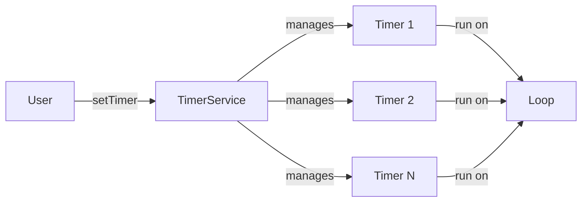
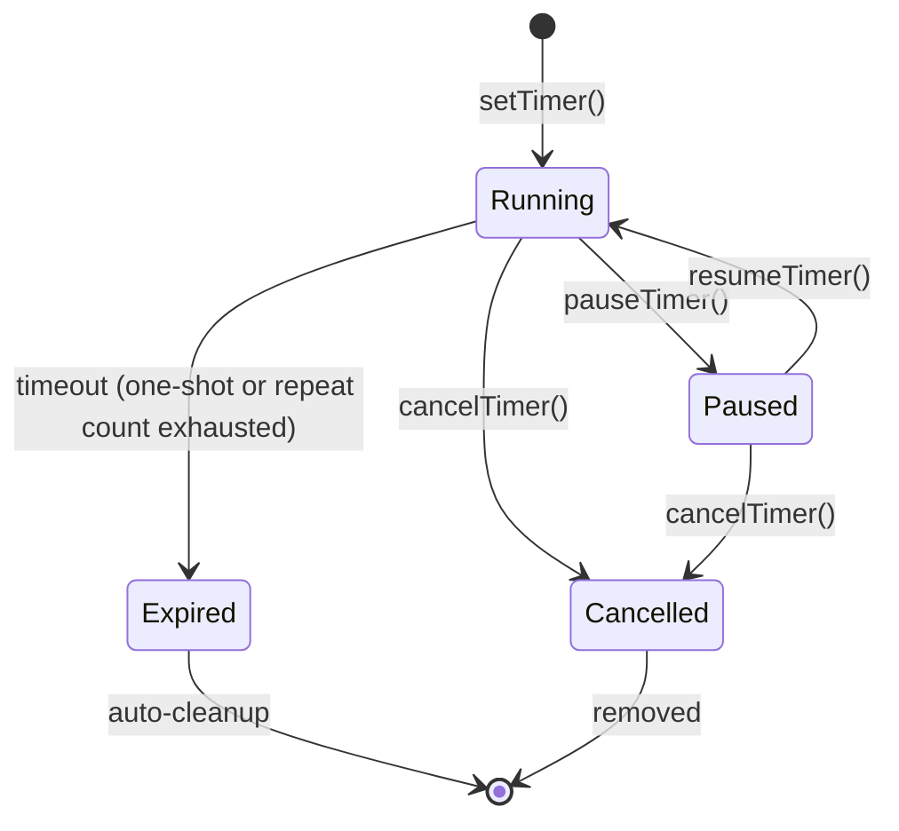
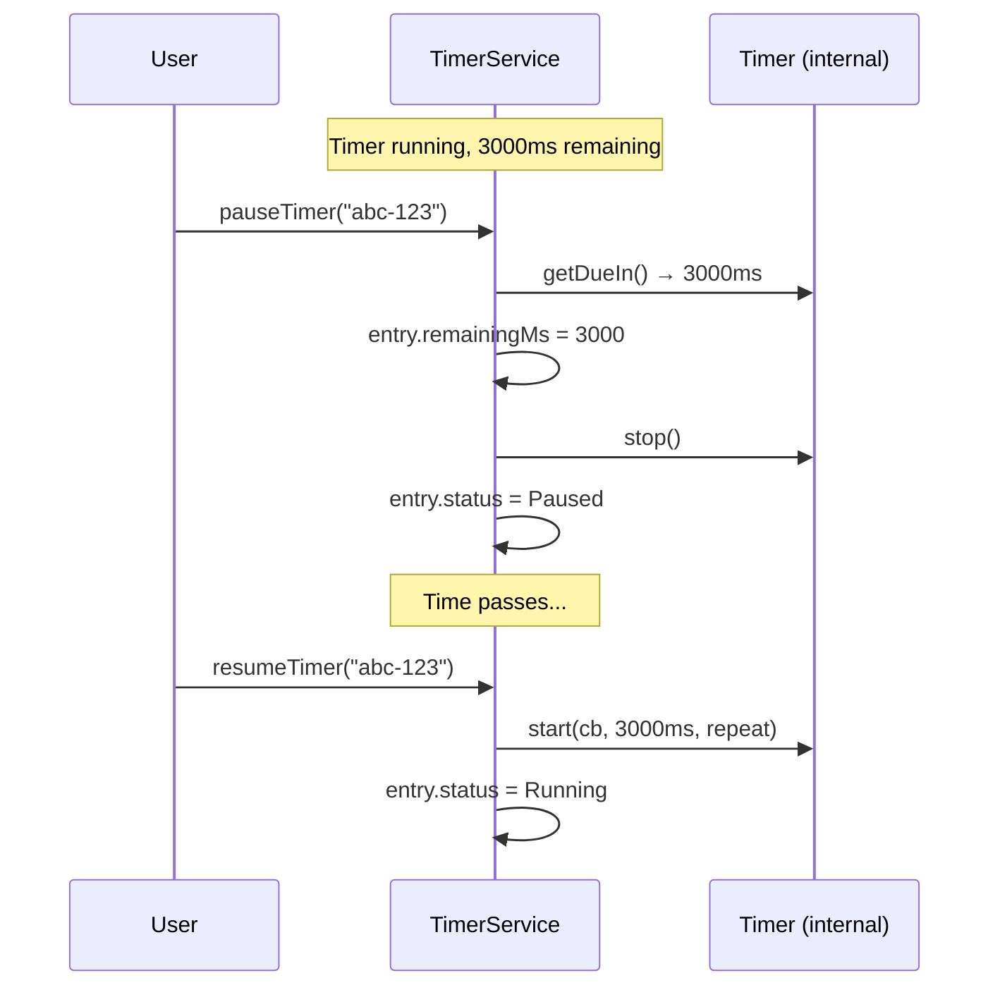
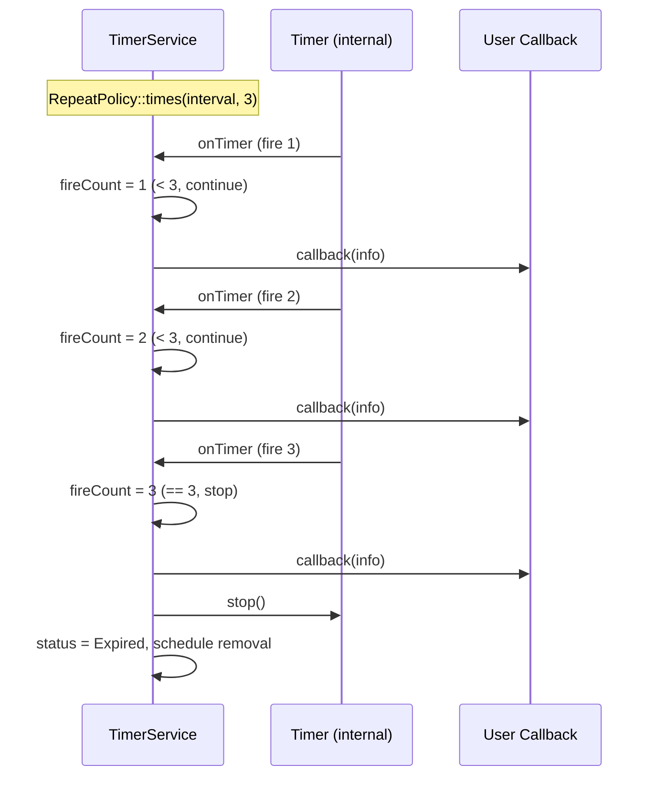

# TimerService — Design Document

## 1. Overview

TimerService is a high-level managed timer API built on top of the low-level `eventengine::Timer` wrapper. It provides user-friendly timer creation with string-based UUIDs, human-readable durations, pause/resume, repeat policies, status queries, and automatic lifecycle management.



---

## 2. Feature List

### Core Features

| # | Feature | Status | Description |
|---|---------|--------|-------------|
| F01 | Set N timers | ✅ Implemented | Create unlimited number of concurrent timers |
| F02 | User-provided string ID | ✅ Implemented | Each timer identified by user-supplied UUID string |
| F03 | Duration units | ✅ Implemented | Specify time in milliseconds, seconds, minutes, hours, days |
| F04 | Callback on timeout | ✅ Implemented | Execute user callback when timer fires |
| F05 | One-shot timers | ✅ Implemented | Fire once, auto-cleanup |
| F06 | Repeating timers | ✅ Implemented | Fire repeatedly at fixed interval |
| F07 | Cancel timer | ✅ Implemented | Stop and remove a timer by ID |
| F08 | Cancel all timers | ✅ Implemented | Stop and remove all timers |
| F09 | Reschedule timer | ✅ Implemented | Change timeout/repeat of existing timer |
| F20 | Max timer limit | ✅ Implemented | Configurable hard cap on concurrent timers (default: 1024) |

### Enhanced Features

| # | Feature | Status | Description |
|---|---------|--------|-------------|
| F10 | Timer status query | ✅ Implemented | Query state: Running, Paused, Expired, Cancelled |
| F11 | Pause / Resume | ✅ Implemented | Pause a running timer, resume with remaining time |
| F12 | Remaining time | ✅ Implemented | Query how much time is left before next fire |
| F13 | Repeat count limit | ✅ Implemented | Repeat N times then auto-stop |
| F14 | Timer label/name | ✅ Implemented | Optional human-readable label for debugging |
| F15 | Timer info in callback | ✅ Implemented | Callback receives TimerInfo struct (id, label, fire count, etc.) |
| F16 | List all timer IDs | ✅ Implemented | Get all active timer IDs |
| F17 | Bulk pause / resume | ✅ Implemented | Pause/resume all timers at once |
| F18 | Timer event listener | ✅ Implemented | Global observer for timer lifecycle events (created, fired, cancelled, etc.) |
| F19 | Thread-safe operations | 🔲 Future | Create/cancel timers from non-loop threads via internal Async |

---

## 3. Duration

### `eventengine::Duration`

A value type representing a time duration, convertible to milliseconds internally.

```cpp
namespace eventengine {

class Duration {
public:
    static Duration milliseconds(uint64_t ms);
    static Duration seconds(uint64_t s);
    static Duration minutes(uint64_t m);
    static Duration hours(uint64_t h);
    static Duration days(uint64_t d);

    uint64_t toMilliseconds() const;

    Duration operator+(const Duration& other) const;
    Duration operator-(const Duration& other) const;
    bool operator==(const Duration& other) const;
    bool operator<(const Duration& other) const;
    bool operator>(const Duration& other) const;

private:
    explicit Duration(uint64_t ms);
    uint64_t ms_;
};

} // namespace eventengine
```

### Usage

```cpp
auto d1 = eventengine::Duration::seconds(30);
auto d2 = eventengine::Duration::minutes(5);
auto d3 = eventengine::Duration::hours(1);
auto d4 = eventengine::Duration::days(1);
auto d5 = eventengine::Duration::seconds(90) + eventengine::Duration::minutes(1);  // 2.5 minutes
```

---

## 4. Repeat Policy

### `eventengine::RepeatPolicy`

Controls how a timer repeats.

```cpp
namespace eventengine {

class RepeatPolicy {
public:
    static RepeatPolicy none();                 // one-shot (default)
    static RepeatPolicy forever(Duration interval);  // repeat indefinitely
    static RepeatPolicy times(Duration interval, uint32_t count);  // repeat N times

    bool isOneShot() const;
    bool isForever() const;
    uint32_t maxCount() const;          // 0 = one-shot, UINT32_MAX = forever
    Duration interval() const;

private:
    Duration interval_;
    uint32_t maxCount_;
};

} // namespace eventengine
```

### Usage

```cpp
eventengine::RepeatPolicy::none()                                          // fire once
eventengine::RepeatPolicy::forever(eventengine::Duration::seconds(5))           // every 5s forever
eventengine::RepeatPolicy::times(eventengine::Duration::minutes(1), 10)         // every 1min, 10 times
```

---

## 5. Timer Status

### `eventengine::TimerStatus`

```cpp
namespace eventengine {

enum class TimerStatus {
    Running,        // timer is active and counting
    Paused,         // timer is paused, remaining time preserved
    Expired,        // one-shot timer has fired (or repeat count exhausted)
    Cancelled       // timer was explicitly cancelled
};

} // namespace eventengine
```

---

## 6. Timer Info

### `eventengine::TimerInfo`

Passed to callbacks and available via query. Provides full context about a timer.

```cpp
namespace eventengine {

struct TimerInfo {
    std::string id;             // user-provided UUID
    std::string label;          // optional human-readable name
    TimerStatus status;
    Duration timeout;           // initial timeout
    RepeatPolicy repeatPolicy;
    uint32_t fireCount;         // how many times this timer has fired
    Duration remainingTime;     // time until next fire (0 if expired)
};

} // namespace eventengine
```

---

## 7. TimerService API (Revised)

### `eventengine::TimerService`

```cpp
namespace eventengine {

class TimerService {
public:
    using Callback = std::function<void(const TimerInfo&)>;

    explicit TimerService(Loop& loop, size_t maxTimers = 1024);
    ~TimerService();

    TimerService(const TimerService&) = delete;
    TimerService& operator=(const TimerService&) = delete;

    // --- Create ---
    Error setTimer(const std::string& id,
                   Duration timeout,
                   Callback cb,
                   RepeatPolicy repeat = RepeatPolicy::none(),
                   const std::string& label = "");
    void setTimerOrThrow(const std::string& id,
                         Duration timeout,
                         Callback cb,
                         RepeatPolicy repeat = RepeatPolicy::none(),
                         const std::string& label = "");

    // --- Cancel ---
    Error cancelTimer(const std::string& id);
    void cancelTimerOrThrow(const std::string& id);
    void cancelAll();

    // --- Pause / Resume ---
    Error pauseTimer(const std::string& id);
    void pauseTimerOrThrow(const std::string& id);

    Error resumeTimer(const std::string& id);
    void resumeTimerOrThrow(const std::string& id);

    void pauseAll();
    void resumeAll();

    // --- Reschedule ---
    Error rescheduleTimer(const std::string& id,
                          Duration timeout,
                          RepeatPolicy repeat = RepeatPolicy::none());
    void rescheduleTimerOrThrow(const std::string& id,
                                Duration timeout,
                                RepeatPolicy repeat = RepeatPolicy::none());

    // --- Query ---
    bool hasTimer(const std::string& id) const;
    TimerStatus status(const std::string& id) const;
    TimerInfo info(const std::string& id) const;
    Duration remainingTime(const std::string& id) const;
    std::vector<std::string> allTimerIds() const;
    size_t activeCount() const;

    // --- Event Listener ---
    using EventListener = std::function<void(TimerEvent, const TimerInfo&)>;
    void setEventListener(EventListener listener);
    void clearEventListener();
};

} // namespace eventengine
```

---

## 8. Timer Lifecycle — State Machine



---

## 9. Internal Architecture

### TimerEntry (Internal)

```cpp
struct TimerEntry {
    std::unique_ptr<Timer> timer;       // low-level uv timer
    Callback callback;
    std::string id;                     // user UUID
    std::string label;
    Duration timeout;                   // original timeout
    RepeatPolicy repeatPolicy;
    TimerStatus status;
    uint32_t fireCount = 0;
    uint64_t remainingMs = 0;           // used for pause/resume
};
```

### Pause/Resume Implementation



### Repeat Count Implementation



---

## 10. Error Handling

| Scenario | Error Code | Behavior |
|----------|-----------|----------|
| Duplicate timer ID | `UV_EEXIST` | setTimer returns error, existing timer unchanged |
| Timer ID not found | `UV_ENOENT` | cancel/pause/resume/reschedule returns error |
| Pause an already paused timer | `UV_EALREADY` | No-op, returns error |
| Resume a non-paused timer | `UV_EALREADY` | No-op, returns error |
| Cancel an expired timer | `UV_ENOENT` | Already cleaned up |
| Max timers exceeded | `UV_ENOSPC` | setTimer rejected, limit configurable via constructor |
| Empty timer ID | `UV_EINVAL` | Rejected |

---

## 11. Usage Examples

### Basic One-Shot Timer

```cpp
eventengine::TimerService svc(loop);

svc.setTimerOrThrow(
    "request-timeout-001",
    eventengine::Duration::seconds(30),
    [](const eventengine::TimerInfo& info) {
        std::cout << "Timer " << info.id << " expired!\n";
    }
);
```

### Repeating Timer with Limit

```cpp
svc.setTimerOrThrow(
    "heartbeat",
    eventengine::Duration::seconds(5),
    [](const eventengine::TimerInfo& info) {
        std::cout << "Heartbeat #" << info.fireCount << "\n";
    },
    eventengine::RepeatPolicy::times(eventengine::Duration::seconds(5), 10)
);
```

### Infinite Repeating Timer

```cpp
svc.setTimerOrThrow(
    "metrics-collector",
    eventengine::Duration::minutes(1),
    [](const eventengine::TimerInfo& info) {
        collectMetrics();
    },
    eventengine::RepeatPolicy::forever(eventengine::Duration::minutes(1)),
    "Metrics Collector"  // label
);
```

### Pause and Resume

```cpp
svc.pauseTimer("metrics-collector");
// ... some time later ...
svc.resumeTimer("metrics-collector");  // resumes with remaining time
```

### Query Timer State

```cpp
auto remaining = svc.remainingTime("heartbeat");
auto st = svc.status("heartbeat");
auto timerInfo = svc.info("heartbeat");
auto allIds = svc.allTimerIds();

std::cout << "Active timers: " << svc.activeCount() << "\n";
std::cout << "Heartbeat remaining: " << remaining.toMilliseconds() << "ms\n";
std::cout << "Heartbeat fired " << timerInfo.fireCount << " times\n";
```

### Cancel

```cpp
svc.cancelTimer("heartbeat");
svc.cancelAll();
```

---

## 12. File Mapping

| File | Content |
|------|---------|
| `include/eventengine/duration.hpp` | Duration value type |
| `src/duration.cpp` | Duration implementation |
| `include/eventengine/repeat_policy.hpp` | RepeatPolicy value type |
| `src/repeat_policy.cpp` | RepeatPolicy implementation |
| `include/eventengine/timer_service.hpp` | TimerService class (revised) |
| `src/timer_service.cpp` | TimerService implementation (revised) |
| `tests/test_timer_service.cpp` | Unit tests |
| `examples/test_timer.cpp` | Example app (revised) |

---

### Cross-Platform Notes

- All code uses C++17 standard library only — no platform-specific APIs.
- `Duration` uses `uint64_t` milliseconds internally — no `<chrono>` dependency to avoid MSVC/GCC/Clang inconsistencies.
- String IDs use `std::string` — no `std::string_view` to avoid lifetime issues across compilers.
- `UV_ENOSPC`, `UV_EEXIST`, `UV_ENOENT`, `UV_EALREADY`, `UV_EINVAL` are portable libuv error codes.
- No use of `__attribute__`, `#pragma`, or compiler-specific extensions in service layer code.

---

## 13. Implementation Tasks

| # | Task | Depends on |
|---|------|-----------|
| TS01 | `Duration` class | — |
| TS02 | `RepeatPolicy` class | Duration |
| TS03 | `TimerStatus` enum | — |
| TS04 | `TimerInfo` struct | Duration, RepeatPolicy, TimerStatus |
| TS05 | Revise `TimerService` — string IDs, Duration, RepeatPolicy | TS01–TS04 |
| TS06 | Implement pause/resume | TS05 |
| TS07 | Implement repeat count limit | TS05 |
| TS08 | Implement status/info/remainingTime queries | TS05 |
| TS09 | Implement allTimerIds, bulk pause/resume | TS06 |
| TS10 | Update `test_timer` example | TS05–TS09 |
| TS11 | Unit tests | TS05–TS09 |
